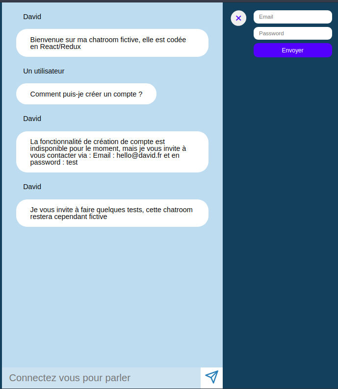
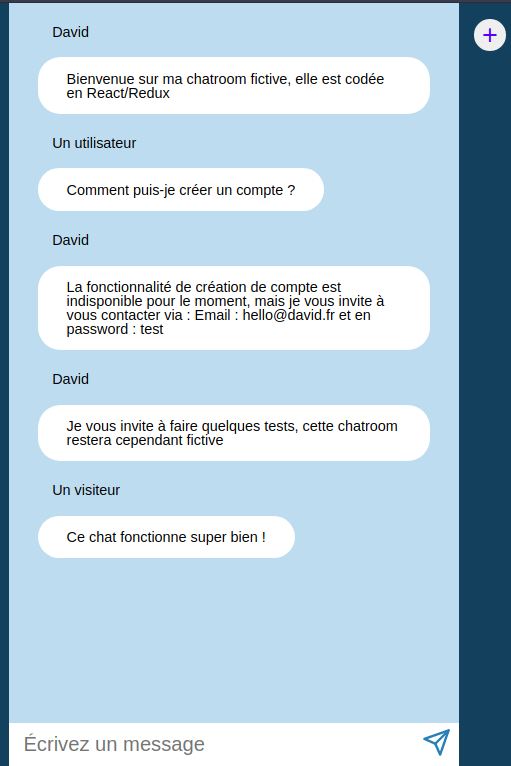

# Chatroom 

Exercice mettant en oeuvre une création d'un projet via React + Redux.

L'objectif n'est pas de deploy le projet, mais de montrer ma manière de coder à travers l'arborescence de mes fichiers :)

Des captures d'écrans des fonctionalités ci jointes :

